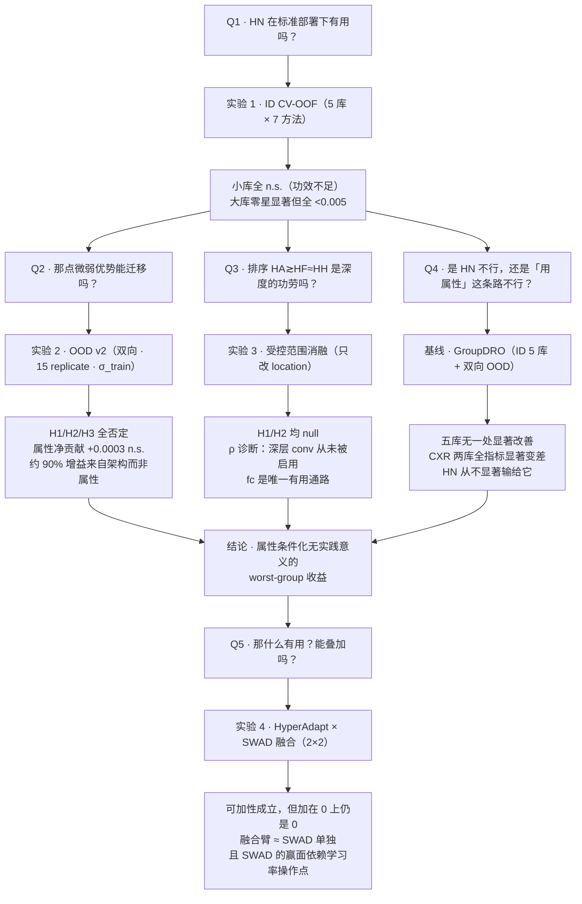

# 实验总览：属性条件化超网络（HN）的公平性评估

> 建立 2026-08-14。本文件是**面向读者的实验串联叙事**，把项目最终成立的四组实验
> （ID CV-OOF regime、OOD 实验 v2、受控条件化范围消融、HyperAdapt×SWAD 融合）
> 按逻辑结构组织成一条证据链。**不产生新数字**：所有结果均可回溯到下列权威文档与结果 JSON。
>
> | 实验 | 权威文档 |
> |---|---|
> | ID CV-OOF regime（五库） | [oof_regime_results.md](oof_regime_results.md)、[groupdro_baseline_5datasets.md](groupdro_baseline_5datasets.md)、[groupdro_baseline_ham.md](groupdro_baseline_ham.md) |
> | OOD 实验 v2（MIMIC↔CheXpert 双向） | [ood_experiment_v2_preregistration.md](ood_experiment_v2_preregistration.md)、[ood_experiment_v2_results.md](ood_experiment_v2_results.md)、[ood_experiment_v2_groupdro.md](ood_experiment_v2_groupdro.md) |
> | 受控条件化范围消融（E0–E4） | [conditioning_ablation_plan.md](conditioning_ablation_plan.md)、[conditioning_ablation_summary.md](conditioning_ablation_summary.md)、[conditioning_ablation_e1_worstcase_checkpoint.md](conditioning_ablation_e1_worstcase_checkpoint.md)、[conditioning_ablation_e1_pathway_knockout.md](conditioning_ablation_e1_pathway_knockout.md)、[conditioning_ablation_e3_fcoff_training.md](conditioning_ablation_e3_fcoff_training.md) |
> | HyperAdapt×SWAD 融合（实验 G） | [hyperadapt_swad_fusion_plan.md](hyperadapt_swad_fusion_plan.md)、[hyperadapt_swad_fusion_full_report.md](hyperadapt_swad_fusion_full_report.md) |
>
> **数字口径**：ID 表一律取自当前权威结果 JSON
> `outputs/conditioning_ablation/oof_results_averaging.json`（2026-08-11）。
> ⚠️ `oof_regime_results.md`（2026-07-20 定稿）中 **HyperAdapt 一列**因 2026-08-04 预测重写而失配。
> **2026-08-30 逐格 diff 订正：不是「MIMIC 一例」，而是四个库全部失配**——
> HAM `.8873/.8188`→`.8910/.8217`、Fitz `.8987/.8331`→`.8935/.8306`、
> MIMIC `.8468/.8201`→`.8461/.8192`、CheXpert `.8675/.8354`→`.8677/.8359`（Overall/marginal worst）。
> **四库 vs-ERM 判决均未改变**；本文与报告一律以 JSON 为准。该文已补挂陈旧提醒横幅。

---

## 0. 一页读完

**问题**：把患者敏感属性（sex / race / age）通过超网络注入分类器，能否在不损失整体性能的前提下
改善 worst-group 公平性？

**答案**：**不能——在本项目所测的五个医学影像数据集、两个 OOD 方向、以及一套锁死混杂轴的受控消融下，
属性条件化都没有带来实践意义的 worst-group 收益。** 四组实验从四个不同角度收敛到同一结论：

| # | 实验 | 回答的问题 | 判决 |
|---|---|---|---|
| **1** | **ID CV-OOF regime**（5 库 × 7 方法） | 三个 HN 在标准 ID 部署下赢 ERM 吗？ | 小库全 n.s.；大库有零星显著但幅度 <0.005 |
| **2** | **OOD 实验 v2**（MIMIC↔CheXpert 双向，预注册 H1–H5） | ID 上那点微弱优势能跨库迁移吗？ | H1/H2/H3/H5 全部否定；**属性信息净贡献 +0.0003 n.s.** |
| **3** | **受控范围消融**（`ResNet18CondNet`，只改条件化范围） | 「条件化更深更好」这条轴本身成立吗？ | H1/H2 均 null；ρ 诊断显示**深层 conv 通路从未被真正启用** |
| **4** | **HyperAdapt×SWAD 融合**（2×2 因子，4 库 ID + 双向 OOD） | HN 的收益能与泛化侧方法叠加吗？ | **可加，但加在 0 上仍是 0**；融合臂 ≈ SWAD 单独 |

**三条贯穿全项目的正面产出**（不是「方法赢了」，而是「知道了什么」）：

1. **GroupDRO 决定性排除了「HN 靠看见属性占便宜」这一混淆**：同样在训练期使用子群标签的标准方法，
   五库无一处显著改善 worst-group，两个胸片库上全指标显著变差，而 HN 从不显著输给它。
2. **null 的成因被机制性地定位**：属性条件化**确实在发生**（置换属性后 100% 样本 logit 改变），
   只是该调制**对排序几乎无贡献**；且低秩乘性 conv 通路**可优化但对本任务无用**，性能目标会自动把它压到最小。
3. **唯一稳定改善 worst-group 的是完全不看属性的 SWAD**（HAM +0.046、Fitzpatrick +0.058，均显著），
   但融合实验揭示**这个赢面绑定在它自己的学习率操作点上**，换一档 lr 就消失，且在 OOD 上不复现。

> **一句话**：属性不是杠杆，泛化才是；而泛化侧的赢面也比看上去脆弱。

---

## 1. 实验版图：两条轴如何切出四组实验

### 1.1 方法轴：模型「怎么用属性」

七个方法沿**属性介入方式**排成一条谱，这是全部比较的骨架：

| 方法 | 属性用在哪 | 推理时看属性？ | 定位 |
|---|---|---|---|
| **ERM** | 不用 | ✗ | 参照零点（attribute-blind） |
| **SWAD** | 不用 | ✗ | 泛化侧基线（loss-valley 权重平均） |
| **GroupDRO** | **训练期损失重加权** | ✗ | **子群感知基线**（对照「HN 是否只是因为看见属性」） |
| **HyperHead** | 推理期条件化 · **仅分类头** | ✓ | HN（最浅） |
| **HyperFusion** | 推理期条件化 · **单个深层 block** | ✓ | HN（中层，`layer4[0].downsample`） |
| **HyperAdapt** | 推理期条件化 · **除 stem 外所有层** | ✓ | HN（最深） |
| **HyperAdapt+SWAD** | 推理期条件化 + 泛化侧干预 | ✓ | 融合臂（实验 4） |

两条关键对照因此天然成立：

- **横向（HN 三档）**：条件化**范围**递增 → 若「越深越好」，应看到 HyperHead < HyperFusion < HyperAdapt。
- **纵向（GroupDRO vs HN）**：两者都吃子群标签，只差**训练期重加权 vs 推理期条件化**
  ⇒ 直接检验「优势是否来自属性本身」。

> 注：ID 主矩阵中还有第三个基线 **ROC**（后处理按组平移阈值）。它是**操作点方法**，
> 按组给分数加常数偏移 ⇒ **组内排序不变 ⇒ 组内 AUC 恒不变**，AUC 口径下捕捉不到其机制
> （PAPILA 上与 ERM 逐位相同）。故本文各表列出其数字仅为完整性，**不参与任何结论**。

### 1.2 评估轴：模型「在哪被考」

| 层次 | 设定 | 回答什么 |
|---|---|---|
| **ID** | 五库各自 5 折 CV-OOF | 标准部署下的公平性 |
| **OOD** | MIMIC↔CheXpert 双向 zero-shot | 换采集源后优势是否保留 |
| **受控消融** | 单一模型 `ResNet18CondNet`，只暴露 `location` 一个开关 | 命名模型之间的差异**能否归因给范围** |

**为什么必须有第三层**：HyperHead / HyperFusion / HyperAdapt 在**范围、参数化、调制形式、容量、初始化**
五个轴上**同时不同**。即使观察到 HyperAdapt > HyperFusion ≈ HyperHead，也**不能**说是「更深」的功劳。
受控消融是唯一能把范围轴单独拎出来的设计。

### 1.3 数据集

| 数据集 | n（评估） | 敏感属性 | 子群数（canonical） | 聚类单位 | 角色 |
|---|---|---|---|---|---|
| HAM10000 | 9,707 | sex × age(4) | 8 | `lesion_id` | 主 ID 库（消融、融合） |
| Fitzpatrick17k | 16,012 | skin(6，单轴) | 6 | 无（每图唯一） | 单轴对照（消融、融合） |
| MIMIC-CXR | 199,356 | sex × race × age | 8 | `patient_id` | 大库 · OOD 源/靶 |
| CheXpert | 138,644 | sex × race × age | 8 | `patient_id` | 大库 · OOD 靶/源 |
| PAPILA | 420 | sex × age | 4 | `pid`（双眼） | 极小库（功效下限） |

---

## 2. 统一评估口径（四组实验共用的地基）

四组实验能被串联，前提是它们**共用同一套评估口径**。这套口径本身是项目的方法学产出之一。

| 项 | 口径 | 为什么 |
|---|---|---|
| **交叉验证** | 5 折 CV-OOF（每样本轮到一次 test） | 全部样本都有干净的折外预测，移除单-split 的评估-n 地板 |
| **聚合** | **averaging**：逐折算指标 → 折间平均，**永不跨折池化分数** | 见 §8.1，池化会把校准漂移测成方法效应 |
| **worst-group** | **先平均后取 min**：`min_g[mean_f AUC(g,f)]` | 「模型在哪组最弱」应是模型属性，不该每折换答案 |
| **marginal / canonical** | marginal = 仅单属性边缘组；canonical = 含 joint 交叉格 | joint 格样本少、argmin 不稳；**marginal 为主指标** |
| **推断** | 患者/病灶级**配对 cluster bootstrap**（B=1000，全方法共用同一批重采样索引） | 预处理只做患者级分组划分、未按患者去重（CheXpert 83% 样本属多图患者） |
| **选择** | 早停用 val Overall AUC；config 用折均 marginal-worst 从 6 配置网格（lr∈{3e-5,1e-4,3e-4}×wd∈{1e-4,1e-3}）中选 | **选择只用 val、评估只用 test**，两者永不交叉 |
| **OOD 额外** | **full-target** 估计量（每 source fold×seed 评完整 target，逐 (f,s) 算指标再平均）· **5 fold × 3 trial = 15 replicate** · **σ_train 判据** | 见 §8.2，单 trial 的 OOD 结论会给出方向相反的答案 |

**两条必须随结果一起表述的边界**：

1. **大 n 下「显著 ≠ 重要」**：MIMIC/CheXpert 十余万样本会把千分位差异推成显著。
   本文一律标注效应分级：`|Δ|≥0.005` = 小但可重复；`<0.005` = **微弱档**。
2. **小库的 null 只能说「未观测到可检出的增量」**：`min_g` 对含噪组 AUC 向下有偏，
   Monte-Carlo 校准显示 HAM 规模上 level 侧偏差 −0.03~−0.04（Δ 侧好得多：−0.006、覆盖率 80–92%）
   ⇒ **不得**表述为「确无效应」。

---

## 3. 实验一 · ID CV-OOF regime（五库 × 七方法）

### 3.1 主表（marginal worst-group AUC，averaging 口径）

粗体 = 该库最优；括注为 Δ vs ERM 的显著性（配对 cluster bootstrap 95% CI 不含 0）。

| 数据集 | ERM | SWAD | GroupDRO | HyperHead | HyperFusion | HyperAdapt | *(ROC)* |
|---|---|---|---|---|---|---|---|
| **HAM10000** (n=9,707) | 0.7976 | **0.8433** \* | 0.8128 | 0.8159 | 0.8310 | 0.8217 | *0.7821* |
| **Fitzpatrick** (n=16,012) | 0.8161 | **0.8739** \* | 0.8583 | 0.8427 | 0.8168 | 0.8306 | *0.8071* |
| **MIMIC** (n=199,356) | 0.8178 | 0.8194 \* | 0.8096 \*↓ | 0.8182 | 0.8179 | **0.8192** \* | *0.8178* |
| **CheXpert** (n=138,644) | 0.8377 | 0.8354 | 0.8215 \*↓ | 0.8337 \*↓ | **0.8406** \* | 0.8359 | *0.8365* ↓\* |
| **PAPILA** (n=420) | 0.8277 | **0.8280** | 0.8072 | 0.7902 | 0.7955 | 0.8155 | *0.8277* |

`*` = 显著；`↓` = 显著**劣于** ERM。

### 3.2 Δ vs ERM（marginal worst，[95% CI]）

| 数据集 | SWAD | GroupDRO | HyperHead | HyperFusion | HyperAdapt |
|---|---|---|---|---|---|
| HAM | **+0.0457** [+.007,+.074] \* | +0.0152 [−.042,+.053] | +0.0182 [−.049,+.067] | +0.0334 [−.041,+.077] | +0.0241 [−.015,+.069] |
| Fitzpatrick | **+0.0578** [+.017,+.105] \* | +0.0422 [−.026,+.104] | +0.0266 [−.026,+.088] | +0.0007 [−.058,+.058] | +0.0146 [−.034,+.065] |
| MIMIC | +0.0016 [+.0004,+.0026] \* | **−0.0082** [−.010,−.007] \* | +0.0004 [−.001,+.002] | +0.0001 [−.001,+.001] | +0.0014 [+.0002,+.0027] \* |
| CheXpert | −0.0023 [−.005,+.0004] | **−0.0162** [−.020,−.013] \* | −0.0040 [−.007,−.001] \* | +0.0029 [+.0004,+.006] \* | −0.0018 [−.005,+.001] |
| PAPILA | +0.0003 [−.059,+.081] | −0.0205 [−.097,+.059] | −0.0375 [−.128,+.035] | −0.0323 [−.096,+.062] | −0.0123 [−.103,+.072] |

### 3.3 三条读数

**① 三个 HN 在小库全部 n.s.，在大库只有零星显著且全在微弱档。**
HAM / Fitzpatrick / PAPILA 上九个 HN 比较无一显著（CI 宽达 ±0.05~0.10 ⇒ 功效不足）。
大库上仅 MIMIC·HyperAdapt（+0.0014）与 CheXpert·HyperFusion（+0.0029）显著为正，
均 **<0.005**，且显著性由 n≥138k 撑起。同时 CheXpert·HyperHead 显著**为负**（−0.0040）。
⇒ **HN 没有一致的正向图景**。

**② 命名模型排序 HyperAdapt ≳ HyperFusion ≈ HyperHead 与「越深越好」方向一致，但不可归因给深度。**
三者五个轴同时不同（§1.2）。这正是实验三存在的理由。

**③ GroupDRO：五库无一处显著改善 worst-group，两个胸片库上三指标全部显著变差。**
这是本项目**最干净的一条排除性证据**（详见 §7.3）。

### 3.4 GroupDRO 的机制：两种截然不同的行为

逐子群 AUC 揭示 GroupDRO 在不同库上做了完全不同的事，这对理解全项目的 null 很关键：

**(a) 组间存在可利用结构时 → 真的重分配**（Fitzpatrick，肤色 VI 是天然稀缺组，n=458）

| skin | I | II | III | IV | V | **VI** | gap |
|---|---|---|---|---|---|---|---|
| ERM | 0.8898 | 0.8906 | 0.9060 | 0.9050 | 0.9065 | **0.8161** | 0.0904 |
| GroupDRO | 0.8832 | 0.8888 | 0.8992 | 0.8964 | 0.9134 | **0.8583** | **0.0551** |

多数组小幅下降、最弱组 +0.042，gap 收窄到**全方法最低**（低于 SWAD 的 0.0578）——教科书式的
GroupDRO 行为，只是幅度不足以显著。

**(b) 组间无可利用结构时 → 全面均匀劣化**（MIMIC，14 个子群无一例外）

| | Male | Female | White | Non-White | <60 | ≥60 | M\|W\|≥60 | F\|W\|≥60 |
|---|---|---|---|---|---|---|---|---|
| Δ vs ERM | −0.009 | −0.007 | −0.009 | −0.005 | −0.008 | −0.008 | −0.009 | −0.008 |

**没有任何重分配**，14 个子群一致下降约 0.008。这不是「没抬起弱组」，而是**根本不存在可交易的
差异化结构**——minimax 重加权只能付出优化代价、买不到任何东西。

**(c) HAM：抬地板变挪地板** —— 把 ERM 最弱格 `Male|80+` 0.788→0.808 抬起，
但 `Male|20-40` 从 0.837 跌到 0.782 接管地板，canonical worst 净变化 −0.006。

---

## 4. 实验二 · OOD 实验 v2（MIMIC↔CheXpert 双向）

### 4.1 设计：为什么要重做 OOD

ID 侧最强的一条 HN 读数是 HyperAdapt 在 M→C 上 +0.0045 显著。但它建立在
**单 trial（`seed = 42 + fold`，训练随机性与数据划分绑死）** 之上。v2 做三件事：

1. **拆开训练随机性**：5 fold × **3 trial** = 15 replicate；
2. **换无池化的估计量**：full-target（每 source fold×seed 评完整 target，逐 (f,s) 算指标再平均）；
3. **引入 σ_train 判据**：效应量必须超过 fold×trial 方差分解给出的训练噪声，
   而不只是通过按患者重采样的 bootstrap。

**四条假设事前预注册**（H1–H4），后按偏离 #3 追加 GroupDRO 第四臂与 **H5**，Holm family 由 4 扩为 6。

### 4.2 主结果（marginal worst-group AUC，full-target，15 replicate）

| 方向 | ERM | SWAD | HyperAdapt | GroupDRO | HA+SWAD |
|---|---|---|---|---|---|
| **M→C** | 0.8125 | 0.8078 | **0.8156** | 0.8056 | 0.8103 |
| **C→M** | **0.7882** | 0.7875 | 0.7857 | 0.7821 | 0.7910 |

| 方向 | 比较 | Δ | bootstrap | \|d̄\| | **σ_train** | t | **超噪声？** |
|---|---|---|---|---|---|---|---|
| M→C | HyperAdapt − ERM | **+0.0031** | 显著 | 0.0031 | 0.0086 | 1.27 | ❌ |
| C→M | HyperAdapt − ERM | **−0.0025** | **显著劣** | 0.0025 | 0.0064 | −0.95 | ❌ |
| M→C | SWAD − ERM | −0.0047 | 显著劣 | 0.0047 | 0.0067 | −2.11 | ❌ |
| C→M | SWAD − ERM | −0.0007 | 显著劣 | 0.0007 | 0.0072 | −0.31 | ❌ |
| M→C | GroupDRO − ERM | **−0.0069** | **显著劣** | 0.0069 | 0.0104 | −2.04 | ❌ |
| C→M | GroupDRO − ERM | **−0.0061** | **显著劣** | 0.0061 | 0.0065 | −3.64 | ❌ |
| M→C | HA+SWAD − ERM | −0.0023 | 显著劣 | 0.0023 | 0.0070 | −1.25 | ❌ |
| C→M | HA+SWAD − ERM | +0.0028 | 显著 | 0.0028 | 0.0040 | 1.56 | ❌ |

### 4.3 假设判定

| 假设 | 内容 | 判定 |
|---|---|---|
| **H1** | HyperAdapt worst-group 优于 ERM 且**两方向复现** | ❌ 不成立（C→M **变号为显著劣**） |
| **H2** | 效应量超过训练噪声 | ❌ 不成立（两方向 \|d̄\| < σ_train） |
| **H3** | 校准不劣于 ERM | ❌ 不成立（M→C 校准显著更差：Δ\|CITL\| +0.0068、ΔECE +0.0068） |
| **H4** | 位于 ID–OOD 拟合线之上 | ⚠️ 不可评估（偏离 #1） |
| **H5** | GroupDRO worst-group 优于 ERM，两方向复现且超噪声 | ❌ **四项全败**（两判据 × 两方向） |

**变号由 trial 扩充所致，不是口径**：C→M 上 `k→k averaging, trial 0` = +0.0017 → `full-target, trial 0`
= +0.0023（换估计量不改符号）→ `full-target, 15 replicate` = **−0.0025**（加入 trial 1/2 后翻转）。

### 4.4 属性 knockout：把「架构效应」与「属性效应」分开

M→C 上 HyperAdapt 的 +0.0031 是**属性**带来的，还是**多出来的架构/容量**带来的？
只有反事实干预能分开：拿**同一份**权重、在**同一批**样本上，只改「模型看到什么属性」再推断。

| 条件 | 做法 | HyperAdapt | Δ vs ERM |
|---|---|---|---|
| 真实 | — | 0.8156 | +0.0031 |
| `permute` | 全局置换属性（保边缘分布） | 0.8149 | +0.0024 |
| **`marginal`** | **输出边缘化** `p(y\|x)=Σ_a p(a)p(y\|x,a)` = 移除属性信息的正确定义 | 0.8154 | +0.0029 |

**属性信息的净贡献**（配对差）：

| 配对差 | Δ | 95% CI | σ_train | t | 判决 |
|---|---|---|---|---|---|
| 真实 − 置换 | +0.0008 | [+0.0003,+0.0012] | 0.0004 | +6.55 | 显著，但**高估**（含「给错属性」的额外惩罚） |
| **真实 − 边缘化** | **+0.0003** | **[−0.0002,+0.0006]** | 0.0004 | +2.66 | **n.s.，且未超训练噪声** |

> **量化判决**：M→C 上 HyperAdapt 的 +0.0031 中，**属性信息贡献约 +0.0003（不显著）**，
> **其余约 90% 来自与属性无关的架构效应**。（另有超参对照显示 legacy +0.0045 中 +0.0043 来自 wd 差异。）

**两个副产品**：

1. **条件化真实发生、但无用**：置换属性后 **100% 样本 logit 改变**，中位 |Δlogit| = 0.0696。
   超网络确实在按属性调制参数，只是该调制对**排序**几乎无贡献。
2. **配对反事实的检出功效极高**：`real − knockout` 的 σ_train = 0.0004，
   而 `knockout − ERM` 是 0.0086~0.0089——**同权重同样本的反事实把共同变异消得极干净**（差 20 倍）。

### 4.5 偏移刻画与校准（两条支撑性读数）

**偏移几乎全是 prior shift，无 concept shift**：P(Y) 30.2% → 8.2%（3.7 倍）；
属性构成 ΔP(A) ≤0.059；6 个 marginal 子群相对总体的患病率方向在两库**完全一致**。

这条读数的作用是**排除一条替代性辩护**：不能说「HyperAdapt 的 OOD 表现差是因为目标域的
属性—标签关系变了、它没跟上」——**关系没变，此路不通**。属性—标签关系确实稳定、确实可迁移，
只是被迁移的那个量的值接近零（§4.4 已量化）。

**校准**（TRIPOD+AI 要求，原 OOD 结论完全未报）：原样跨库迁移的校准严重失准且被 AUC 完全掩盖——
M→C 系统性高估（CITL +0.10~+0.13，ECE 0.097–0.125）、C→M 系统性低估（CITL −0.15~−0.17，ECE 0.151–0.166）；
**单一全局单调重校准即可修复**（ECE 降 40–50 倍），这与「无 concept shift、偏移基本是全局平移」自洽。
HyperAdapt 与 GroupDRO **各自独立地**呈现「一个方向显著更好、另一个显著更差，且均在训练噪声之内」
的同形模式 ⇒ **跨库校准的方向性差异更像方法与偏移方向的偶然配合，不是任一方法的稳定属性。**

### 4.6 ID → OOD 的传导（GroupDRO 提供的干净样本）

| 数据集 / 方向 | Δmarg worst（GroupDRO − ERM） |
|---|---|
| **ID** MIMIC | −0.0082 \* |
| **ID** CheXpert | −0.0162 \* |
| **OOD** M→C（源 = MIMIC） | −0.0069 \* |
| **OOD** C→M（源 = CheXpert） | −0.0061 \* |

1. **劣势按「源域训练库」传导且方向一致**：四个数字全为负，与「无 concept shift ⇒ source 域的
   相对优劣被忠实搬运到 target」一致——只是这次搬运的是劣势。
2. **量级不成比例**：CheXpert 的 ID 劣势（−0.0162）是 MIMIC（−0.0082）的两倍，其 OOD 劣势
   （−0.0061）反而略小于 M→C（−0.0069）。⇒ **ID 差距不能线性外推到 OOD**；跨库评估会压缩
   方法间差异（目标域自身难度成为共同主导项）。

---

## 5. 实验三 · 受控条件化范围消融（E0–E4）

### 5.1 设计：把「范围」从五个混杂轴里单独拎出来

用**统一模型 `ResNet18CondNet`**、只暴露 `location` 一个开关，得到**严格嵌套**的四个 cell
（参数共享 / rank / 参数化 / 初始化 / 编码器全部锁死）：

| cell | 条件化范围 | 对齐的命名模型 |
|---|---|---|
| **ERM** | 无 | 参照零点 |
| **C-Head** | 仅 fc | HyperHead 位置 |
| **C-Deep** | fc ＋ layer4 全 conv | 深层单 stage |
| **C-Full** | fc ＋ layer1–4 全 conv | HyperAdapt 位置 |

C-Head ⊂ C-Deep ⊂ C-Full，fc 条件化三档恒定 ⇒ 增量干净。
**两个确认性主假设**：H1 = C-Deep − C-Head（属性是否需进 backbone）；H2 = C-Full − C-Deep（继续向浅层扩展是否有额外效用）。

> **E0 的 canonical base state**：每 `(dataset, fold, seed)` 用确定性种子冻结同一份 base backbone / base fc，
> 使所有 cell（含比较用 ERM）的 base 权重**逐元素相等**——否则「Δθ=0 等价 ERM」只对 cell 自身成立、
> 不对比较用的 ERM 成立。锁死设定经 adapter 参数量交叉验证（C-Full = 2,760,260，与方案冻结值逐位吻合）。

### 5.2 结果

**E1 · HAM10000（ID，n=9,707 / 7,280 病灶）**

| cell | Overall | marginal worst | Δworst vs ERM |
|---|---|---|---|
| ERM | 0.8925 | 0.8227 | — |
| C-Head | 0.8954 | 0.8194 | −0.0033 n.s. |
| C-Deep | 0.8947 | 0.8225 | −0.0002 n.s. |
| C-Full | 0.8963 | 0.8214 | −0.0013 n.s. |

**H1 = +0.0030（Holm 0.839）、H2 = −0.0011（Holm 0.839）⇒ 均未达显著；最小观测有效配置 = 无。**

**E2 · MIMIC→CheXpert（OOD，full-target，n=138,644）**

| cell | Overall | marginal worst |
|---|---|---|
| ERM | 0.8503 | 0.8132 |
| C-Head | 0.8504 | 0.8131 |
| C-Deep | 0.8503 | 0.8143 |
| C-Full | 0.8497 | 0.8126 |
| *(SWAD 参照)* | *0.8482* | *0.8085* |

**双侧判决**（E2 改双侧）：

| 假设 | Δworst | 95% CI | Holm p | 三分判决 |
|---|---|---|---|---|
| H1: C-Deep − C-Head | +0.0012 | [+0.0005,+0.0020] | 0.004 | 「改善」\* |
| H2: C-Full − C-Deep | −0.0016 | [−0.0024,−0.0008] | 0.004 | **「有害」** |
| C-Full vs ERM（复现） | −0.0005 | [−0.0016,+0.0005] | 0.324 | n.s. |

三条边界必须随结论一起表述：(1) 所有 |Δ| ≤ 0.0016 < 0.005 ⇒ **统计可检出但实践可忽略**；
(2) H1 的「改善」**训练稳定性不足**（5 折仅 3/5 为正、LOFO 去一折即变号）；
(3) C-Full 未复现 legacy 的 M→C 正向。
> **改双侧的价值即刻兑现**：H2 呈负向「有害」，旧单侧设计会漏掉这个退化方向。

### 5.3 机制诊断：范围轴 null 的两种可能，被 ρ 分开

范围 null 有两种解释——**(a) 深层位置本身无用**，还是 **(b) 深层位置从未被优化真正启用**？

- **ρ** = `E_a‖ΔW_l(a)‖_F/‖W_l‖_F`（该层被改动多少）
- **ρ^between** = 偏移中**随属性变化**的部分 ← 只有它能证明「按属性分化」而非「静态重参数化」

| | fc ρ | fc ρ^between | conv ρ | conv ρ^between | fc/conv |
|---|---|---|---|---|---|
| **HAM (E1)** | ~1.0 | ~0.70 | 0.013~0.02 | 0.010~0.016 | **45~60×** |
| **MIMIC (E2)** | 0.02~0.04 | 0.02~0.04 | 0.005~0.010 | 0.004~0.009 | ~5× |

**两库的 null 同向但不同因**：
- **HAM**：fc 强条件化、**backbone conv 近乎未被启用** ⇒ 扩范围多加的 conv adapter **优化根本没用起来**，三档行为本就差别极小；
- **MIMIC**：**哪里都几乎不条件化**（fc ρ 仅 0.04，比 HAM 弱 25×），但那点微弱偏移仍属性特异（ρ^between/ρ ≈ 0.9~0.97，是真条件化）。

### 5.4 三个敏感性实验：确证「conv 未启用」不是伪影

「深层 conv 未被启用」面临三种「其实是别的原因」的替代解释，被逐一排除：

| # | 实验 | 排除的替代解释 | 结果 |
|---|---|---|---|
| ① | 换 `best_worstcase` checkpoint 复评 | 「是 checkpoint 选择策略的伪影」 | conv ρ^between 几乎不变，**fc/conv 仍 48~63×**；fc 偏移不降反升；H1/H2 仍全 n.s. |
| ② | 通路 knockout × 属性置换 | 「ρ 是权重层面的，行为上未必如此」 | Overall 的 age 依赖 **100% 由 fc 承担**；C-Deep 的 conv **完全惰性**（关 fc 后仅保留 7%、塌进 0.9σ 噪声）；C-Full 的 conv 残留 45% 但仅 1.6σ |
| ③ | **关 fc 从头训练** C-Deep/C-Full | 「fc 只是阻力最小路径，conv 本可承担」 | **conv 可被优化**（关 fc 后 ρ^between 单调增长 0.012→0.052、B 生成器梯度从 ~0 解锁）；**但激活 conv 与性能反向**（val 掉到 0.862/0.585）；早停在 val 峰值处 conv 与 fc-on 版**几乎相同**，行为退回近属性无关 |

**三实验闭环的精细判决**：移除 fc **不是**把条件化重路由进 conv，**而是丢失条件化**。
低秩**乘性 conv 调制**可优化，但它学到的东西**对本任务无用**（激活反而降性能），
故性能目标自动把 conv 压到最小、即便 fc 不在。
**fc 的加性低秩头几乎是这套超网络唯一能有用表达（弱）属性信号的通路。**

> **指向**：要让 conv 承载有用条件化，须改**参数化本身**（乘性→加性 / 更高 rank / 判别方向正则），
> 而非仅关 fc、调 checkpoint 或训练时长。

### 5.5 与命名模型比较的交叉印证

ID 主矩阵中命名模型排序 HyperAdapt ≳ HyperFusion ≈ HyperHead，方向似乎支持「越深越好」。
**但唯一只改范围的受控消融在 HAM 与 M→C 上均判 null**，且 ρ 诊断显示深层 conv 从未被启用
⇒ **HyperAdapt 的微弱一致优势很可能来自范围以外的轴（容量/参数化/初始化），而非「条件化更深」本身。**
这与 §4.4 的 knockout 判决（增益约 90% 来自与属性无关的架构效应）**互为独立佐证**。

---

## 6. 实验四 · HyperAdapt × SWAD 融合（2×2 因子）

### 6.1 设计与动机

前三组实验确立了两件事：**HN 的增量≈0**，而 **SWAD 是唯一有实质幅度的 worst-group 赢家**。
自然的追问是：**SWAD 的收益能否传递到 HN 架构上并产生超越？**（对比较协议「SWAD 不与 HN 组合」的受控破例。）

2×2 因子设计 = {ERM, HyperAdapt} × {best-ckpt 选择, SWAD loss-valley 权重平均}，
四格中三格复用既有 CV-OOF 产物，仅 **HA+SWAD** 一格新训。超参不新搜（复用对应 HyperAdapt 的选定 config）。
范围：**4 数据集 ID + MIMIC↔CheXpert 双向 OOD**，OOD 严格遵循 v2 口径。

事前定量零假设：`HA+SWAD ≈ SWAD + (HA − ERM) ≈ SWAD`（由 SWAD+CORAL 先例推出）。

### 6.2 ID 结果

**Fitzpatrick 是唯一四臂同 config、无混杂的库，以它为准**：

| 基座 | Δ marginal worst | Δ Overall |
|---|---|---|
| ERM → SWAD | +0.0578 | +0.0244 |
| HyperAdapt → HA+SWAD | **+0.0446** | **+0.0263** |

两个增量量级相当 = **可加性的直接证据**。对比检验：

| 对比 | Δ marginal worst | 95% CI | p_Holm |
|---|---|---|---|
| HA+SWAD − ERM | +0.0591 | [+0.016, +0.106] | **0.042 显著** |
| HA+SWAD − HA | +0.0446 | [+0.012, +0.080] | **0.016 显著** |
| **HA+SWAD − SWAD** | **+0.0013** | [−0.031, +0.031] | **1.000 n.s.** |
| **Δ_int** | −0.0132 | [−0.066, +0.036] | 1.000 n.s. |

⇒ **融合臂显著优于 ERM、也显著优于 HyperAdapt 单独，但与 SWAD 单独打平；交互项为零。**
全部增量来自 SWAD 因子，HN 因子贡献 0，两者不互相干扰。

**四库 config 匹配后的交互项**（朴素差中差在三库中均受 config 混杂污染，见 §8.3）：

| 数据集 | ERM 侧 SWAD 增量 | HN 侧 SWAD 增量 | Δ_int | 判定 |
|---|---|---|---|---|
| Fitzpatrick | +0.0578 | +0.0446 | −0.0132 | n.s. |
| HAM10000 | +0.0021 | +0.0040 | +0.0019 | n.s.（两侧均≈0） |
| CheXpert | +0.0043 | +0.0065 | +0.0022 | n.s. |
| MIMIC-CXR | +0.0020 | −0.0005 | −0.0025 | p=0.002 显著为负（|Δ| 小于该库 SWAD 主效应本身） |

**H1（Δ_int > 0 且跨库复现）四库无一支持。**

### 6.3 OOD 结果

融合臂的效应**两方向变号**（M→C −0.0023 / C→M +0.0028），交互项 M→C −0.0006 / C→M +0.0060
**均远小于 σ_train 且符号相反** ⇒ OOD 上不支持任何交互结论。
六个 OOD 检验全部「Holm 后仍显著」但**无一超过训练噪声**（§4.2 表）。

### 6.4 校准终点与三条附带读数

**校准侧曾是本实验唯一的候选正面读数，在补做 full-target × 15 replicate + σ_train 后被否定**：
主要终点 ECE 的 8 个检验（4 对比 × 2 方向）**无一超过训练噪声**，尽管 bootstrap CI 全部 Holm 后显著；
且「SWAD 的校准收益向 HN 等量传递」这一旧读数不复现（两方向 Δ_int 变号）。
⇒ **本实验在任何终点上都没有正面结论。**

三条仍然有价值的读数：

1. **SWAD 的收益由学习率主导，而非架构**：HAM 上 lr3e-04 时 SWAD 给 ERM +0.046 worst-group，
   lr3e-05 时只剩 +0.002。且**混杂幅度随两侧 lr 差异单调变化**（lr 差 10× 的 HAM 污染最重、
   差 3× 的 CheXpert 次之、仅 wd 差的 MIMIC 几乎不受影响）——这为该结论提供了独立于 HAM 的第二条证据。
   ⇒ 「SWAD 是最稳健的公平性基线」应改述为「**在其选中操作点上**最稳健」。
2. **H2（SWAD 稳定 HN 的折间方差）获多数库方向性支持但未获检验**：4 库中 3 库方向一致
   （Fitzpatrick / CheXpert / MIMIC 支持，HAM 相反）；5 折无检验功效 ⇒ 仅作描述性呈现。
3. **实现稳健性核验**：本项目 SWAD 对 BatchNorm 统计做算术平均，官方用 `update_bn` 重估；
   补做对齐后重推理（ID 四库 + 双向 OOD）**所有结论逐条不变**。

### 6.5 功效声明（预注册，不得违反）

| 数据集 | 终点 | MDE(80%) | 参照真效应 | 判定 |
|---|---|---|---|---|
| HAM / Fitzpatrick | Overall | 0.007–0.012 | 0.019–0.024 | 有功效 |
| HAM / Fitzpatrick | marginal worst | 0.045–0.089 | 0.046–0.058 | 🛑 **无功效** |
| MIMIC | marginal worst | 0.0015 | 0.0016 | 有功效 |
| CheXpert | marginal worst | 0.0041 | −0.0023 | 有功效 |

> ⚠️ **两库版的核心局限（worst-group 无功效）在 CXR 两库上被解决（MDE 降 10–40 倍），
> 但必须同时限定：CXR 两库的 SWAD 主效应本身≈0** ⇒ 那里的交互检验虽功效充足，
> 测的却是一个**退化情形**——没有多少「SWAD 收益」可供传递。**「有功效」与「所测现象存在」是两件事。**

---

## 7. 证据链：四组实验如何合成一个结论

### 7.1 从「我们的方法没赢」到「这类方法赢不了」

单独看实验 1，只能说「我们实现的三个 HN 没有改善」。三条独立证据把它升级为一个机制性结论：

| 证据 | 来源 | 排除了什么 |
|---|---|---|
| 属性 knockout：净贡献 +0.0003 n.s.，90% 增益来自架构 | 实验 2 §4.4 | 「HN 的增益是属性带来的」 |
| ρ^between + 三个敏感性实验：深层 conv 可优化但对任务无用 | 实验 3 §5.3–5.4 | 「是我们没把属性接到正确的位置」 |
| GroupDRO 五库无一改善、CXR 全指标变差 | 实验 1 §3.4 + 实验 2 §4.6 | 「是条件化这个形式不对，换重加权就行」 |

### 7.2 一个反复出现的形态：「条件化了，但没用」

三组实验各自独立地观察到同一现象：

- **行为层面**（实验 2）：置换属性后 **100% 样本 logit 改变**（中位 |Δlogit| 0.0696），但排序几乎不变；
- **权重层面**（实验 3）：ρ^between/ρ ≈ 0.9~0.97 ⇒ 偏移**确实随属性分化**，是真条件化，只是幅度微弱且落在 fc；
- **优化层面**（实验 3 ③）：把 fc 关掉逼模型走 conv，conv **确实被激活**，但**性能反而下降**，早停自动退回。

⇒ **null 的成因不是「模型忽略了属性」，而是「模型用上了属性、但属性对排序没有可用信息」。**

### 7.3 GroupDRO 这个基线买到了什么

导师要求补的「训练时使用子群标签」的第四基线，兑现了三件事：

1. **决定性排除「HN 靠属性占便宜」的混淆**——同样吃子群标签的标准方法并没有更好；
   HN **在任何数据集的任何指标上都没有显著输给它**，在 MIMIC/CheXpert 上全指标显著更优。
2. **提供了「组间无可利用结构」的正面指纹**——MIMIC 14 子群一致下降 0.008、零重分配（§3.4b），
   与 Fitzpatrick 的真重分配（§3.4a）形成对照，说明方法本身没坏、是数据侧没有可交易的结构。
3. **贡献了全 OOD v2 唯一超过训练噪声的效应**（C→M Overall −0.0055，t=−3.98）——
   **正面效应至今一个都没超过噪声，唯一超过的是负面效应**。这反过来证明 σ_train 判据**有区分力、不是钝器**。

### 7.4 SWAD：唯一的赢家，以及它有多脆

| regime | SWAD − ERM（marginal worst） |
|---|---|
| HAM | **+0.0457 显著** |
| Fitzpatrick | **+0.0578 显著** |
| MIMIC | +0.0016 显著（微弱档） |
| CheXpert | −0.0023 n.s. |
| **M→C OOD** | **−0.0047 显著劣** |
| C→M OOD | −0.0007 显著劣 |

SWAD 在两个小库上给出全项目最大的 worst-group 改善，**且它完全不看属性**。
但融合实验揭示这个赢面**绑定在其选中的学习率操作点上**（HAM lr3e-04 → +0.046；lr3e-05 → +0.002），
且**在两个 OOD 方向上都不为正**。⇒ 恰当表述是「**在其选中操作点的 ID 设定下**，SWAD 是最划算的公平基线」。

---

## 8. 方法学产出（可迁移，价值可能高于主结论）

四组实验过程中发现并修复了四类「显著性来自口径而非真效应」的缺陷。它们**改变了已发表过的结论**，
因此本身构成产出。

### 8.1 pooled-OOF AUC 的悲观负偏（学界已知缺陷，本项目实测并改口径）

把 5 折预测**拼成一个向量再算一个 AUC** 会构造出**跨折正负对**（折 i 阳性 vs 折 j 阴性），
而各折是**不同模型**、logit 尺度因早停轮数异质而漂移。文献：Parker/Günter/Bedo (2007) *BMC Bioinformatics* 8:326；
Airola et al. (2010) *JMLR W&CP* 8:3–13（推荐 averaging）；Forman & Scholz (2010) *SIGKDD Explorations* 12(1):49–57。

- **实测**：HAM 某 run 逐折 logit 中位数 `[-7.6, -4.0, -23.0, -6.0, -11.2]`（跨折差 19 个单位），
  逐折 test AUC 均值 0.831 **却池化成 0.639（−0.192）**。
- **致命之处**：污染程度**因方法系统性不同** ⇒ 组间比较测的是**校准漂移**而非真效应
  （`corr(跨折 logit SD, 池化惩罚) = −0.607`；小库受害重、大库近乎免疫）。
- **修复 = averaging**，且**不损失评估 n**（抬 n 的功劳来自 CV 本身而非 pooling；实测 SE 反而小 8–28%）。
- **代价如实报告**：小 joint 格可能某折只剩一类 ⇒ 该折 AUC 无定义（HAM 1/40、**PAPILA 5/40**
  ⇒ PAPILA 的 canonical worst 不可解读）。

### 8.2 bootstrap 的「显著」与训练噪声无关

OOD v2 中四项比较的 bootstrap CI 全部显著、Holm 后全部保持——**但同样这四项，效应量全都小于训练噪声**。
两者不矛盾，因为量的是不同的不确定性：

| 不确定性来源 | 回答的问题 | 量级 |
|---|---|---|
| 患者级 cluster bootstrap | 「换一批病人」 | CI ±0.0006~0.0012（n≈14–20 万） |
| fold × trial 方差分解 | 「换一次训练随机种子」 | **σ_train ≈ 0.006–0.009** |

⇒ **只报 bootstrap CI 会系统性高估 OOD 结论的可靠性。** 任何 Δ<0.005 量级的 OOD 差异结论，
都必须同时报告训练侧不确定性。且**单 trial 的 OOD 结论不可靠**——本项目中它给出了方向相反的答案（§4.3）。

### 8.3 差中差必须匹配 config

融合实验的朴素 Δ_int 在 HAM 上 = −0.0184（Holm p=.004，高置信显著），但四臂 config 不同 ⇒
混杂的是**学习率**而非架构。用已落盘的同 config 对照重测后 Δ_int = **+0.0017（p=.580）**，
**符号翻转、效应归零**。CheXpert 同样在匹配后失去显著性。
⇒ **若无此对照，两个库会各自得出一个方向相反且高置信的错误结论。**

### 8.4 优化目标与报告指标的错配（DRO 类方法的结构性问题）

GroupDRO 最小化 worst-group **损失**，而公平性报告的是 worst-group **AUC**。
在类别极不均衡的医学数据上二者可以严重不一致——实测对抗权重 q 顶在：

| 数据集 | q 最高的组 | AUC 最弱的组 |
|---|---|---|
| Fitzpatrick | skin:II（**最大的组**） | skin:VI |
| MIMIC | `Female\|White\|≥60` | `Male\|White\|≥60` |
| HAM | `Male\|40-60`（**多数组**） | `Male\|80+` |

即 GroupDRO 把权重投向「BCE 最难拟合」的组，而非「排序能力最差」的组。
这解释了为什么它的重分配即使发生也常落不到被报告的那一格上。
**这是把 DRO 类方法迁到 AUC 口径公平性任务的结构性问题，不是本实现的缺陷**
（AUC 不可分解为逐样本损失，无法直接做成 DRO 目标）。

### 8.5 三条工程教训

1. **派生模型命名必须与基座隔离**：`_finalize_swad` 曾把 method 硬编码为 `"swad"`，HN 开 `--swad` 会
   **静默覆写** ERM-SWAD 基线（HAM cv5 下确有撞车）。已修为 `swad_method_name()` 并加回归自测。
2. **「同 config + 同 seed」在本项目不等于可复现**：重跑后逐折 logit 相关 HAM 0.96–0.998、
   **Fitzpatrick 仅 0.74–0.90**（根因：val AUC 曲线顶部平坦 + argmax 选到不同 epoch）
   ⇒ 任何单次运行之间 |Δ| < ~0.005 的差异都在重跑噪声内。config 选择本身也不稳健。
3. **「成功执行但产出不含目标对象」的静默失败**：两个校准脚本因读 legacy 预测目录 / 硬编码对比清单
   而**静默丢掉 GroupDRO**，退出码 0、无任何警告。**必须核对输出里的方法名，不能以「跑成功了」为准。**

---

## 9. 边界与限制（须随结论一起表述）

1. **小库的 null 是「未观测到可检出的增量」，不是「确无效应」**（HAM/Fitzpatrick/PAPILA 上 HN 比较
   CI 宽达 ±0.05~0.10；`min_g` 的动态 argmin 另有向下偏）。
2. **大 n 下显著 ≠ 重要**：MIMIC/CheXpert/OOD 的多数 Δ<0.005。
3. **PAPILA（n=420）无功效**，其 canonical worst 与 gap 因 5/40 折-格 AUC 无定义而**不可解读**。
4. **OOD 只有 MIMIC↔CheXpert 一对**，且**不含 HyperHead / HyperFusion**（v2 用户指定范围）
   ⇒ **OOD 上不得推出任何「条件化深度」结论**。
5. **受控消融的表述边界**：H1/H2 是范围间**优效/劣效比较**，**不能**证明某些层「必要」或「无用」——
   全文禁用「必要成分 / 充分条件 / 范围阈值」；且 ρ 诊断显示深层位置**从未被真正启用**，
   故正确表述是「在当前统一低秩训练设定下，扩大可用条件化范围未改变模型行为」，
   而非「深层位置本身无效」。
6. **GroupDRO 的 η 未搜**（固定论文默认 0.01，为与其它方法共用同一 6 配置网格）。
   q 动力学显示四库合理、**CheXpert 偏大**（单组吃掉 48–62% 权重）、**PAPILA 偏小**
   （q 倍差仅 1.1×，实质是**组均衡 ERM**，该库结果不应作为 GroupDRO 本身的证据）。
   故其负结果只能说「**在与其它方法同等超参预算下无效**」。
7. **融合实验仅 HyperAdapt 一个 HN**，且其前提是「HN 增量为 0」；
   在 HN 本身有实质增量的设定下（本项目无），可加性结论未必成立。
8. **ROC 不能用 AUC 评**（操作点方法，组内 AUC 不变）⇒ 各表中 ROC 数字无方法学意义。
9. **本项目全部结果基于 ResNet-18 backbone 与所测模型族**，不外推到其它架构。

---

## 10. 关键产物索引

| 内容 | 路径 |
|---|---|
| **ID 权威结果 JSON**（7 方法 × 5 库 + 2 OOD 方向） | `outputs/conditioning_ablation/oof_results_averaging.json` |
| ID 聚合脚本 | `scripts/build_oof_results_averaging.py`、`scripts/select_config_cv.py` |
| OOD v2 主分析 / knockout / 校准 / 偏移刻画 | `outputs/ood_cxr/{variance_decomposition,knockout,calibration,shift_characterization}/` |
| OOD v2 分析脚本 | `scripts/ood_variance_decomposition.py`、`ood_knockout_analysis.py`、`ood_calibration.py`、`ood_shift_characterization.py`、`ood_hparam_matched_control.py` |
| 受控消融模型 / 训练 / 分析 | `src/models/resnet18_condnet.py`、`src/training/{train_condnet,run_e2_ood_full_target}.py`、`scripts/{e1_ham_analysis,e2_ood_analysis,e1_rho_and_permutation}.py` |
| 受控消融结果 JSON | `outputs/conditioning_ablation/e2_ood_results.json`、`ham10000/cv5/{e1_ham_results_averaging,e1_rho_between}.json`、`mimic_cxr/cv5/e2_rho_between.json` |
| GroupDRO 实现 / 入口 | `src/training/harness/groupdro.py`、`src/training/{train_groupdro,train_ham10000_groupdro}.py` |
| 融合实验分析 | `scripts/{g_fusion_analysis,g_mde_worstgroup,g_drift_check,g_ood_calibration_full_target,g_bn_update_analysis}.py`、`outputs/analysis/g_fusion/` |
